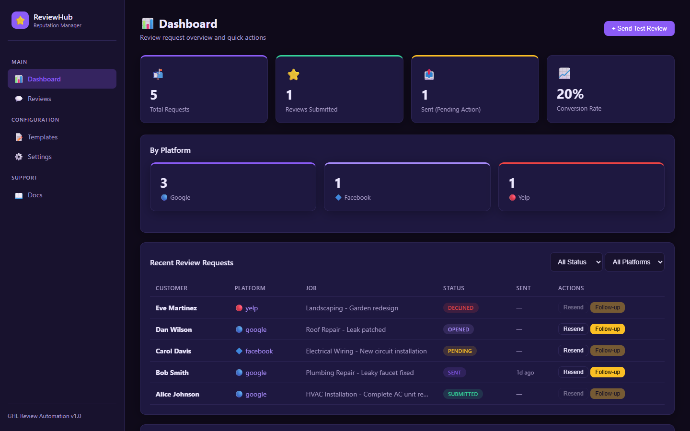
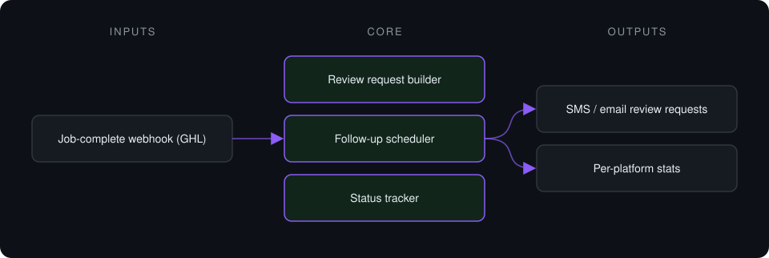
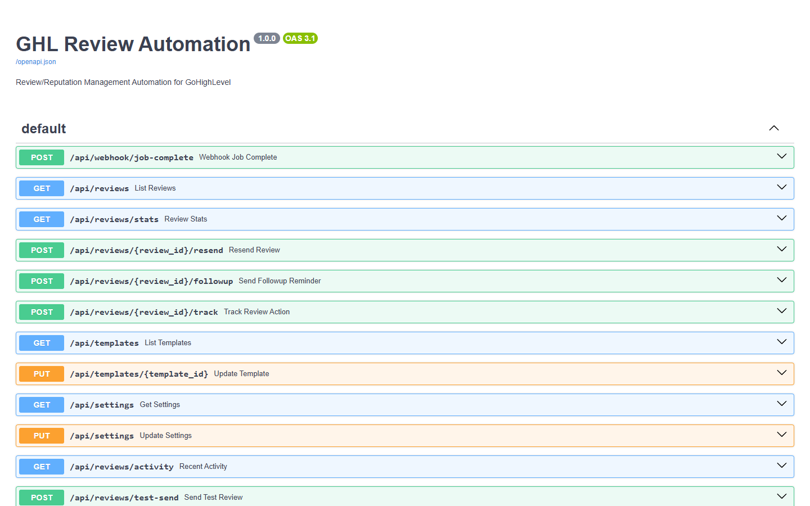

# GHL Review Automation

**Review-request automation for GoHighLevel: a completed job triggers a Google, Facebook or Yelp review request with smart follow-up. Sending is simulated in this version.**

> **This is a proprietary project. Source code is private. This page showcases the system's architecture and results.**

**Case study page:** [https://jryahia.github.io/showcase-ghl-review-automation/](https://jryahia.github.io/showcase-ghl-review-automation/)

## Problem it solves

Happy customers rarely leave reviews unless asked at the right moment. This system sends the request automatically when GoHighLevel marks a job complete, follows up if there is no response, and tracks the outcome.

## Architecture

1. GoHighLevel signals a completed job.
2. A review request is created for the chosen platform and sent from a template.
3. If there is no action, reminders go out up to a configured limit.
4. Request status moves from pending to sent, opened, and submitted or declined.

## Key features

- Google, Facebook and Yelp review links
- Template system with placeholders
- Configurable follow-up delay and count
- Lifecycle tracking per request
- Dashboard with activity feed

## Tech stack

    

## What it does in practice

- Prototype stage: the request lifecycle, templates and follow-up scheduling are built; SMS/email sending is simulated (Twilio/SendGrid hookup is the next step).

## Screenshots

> Screenshots show the app running on seeded demo data, not client data.

**Requests by platform and status**

**API surface: webhooks, requests, templates, follow-ups**

---

Built by [Yahya Jarray](https://github.com/jryahia). Interested in a similar system? [Get in touch](mailto:yahiajarray43@gmail.com).

This repository contains no source code. It is a case study for a proprietary project. © Yahya Jarray.
